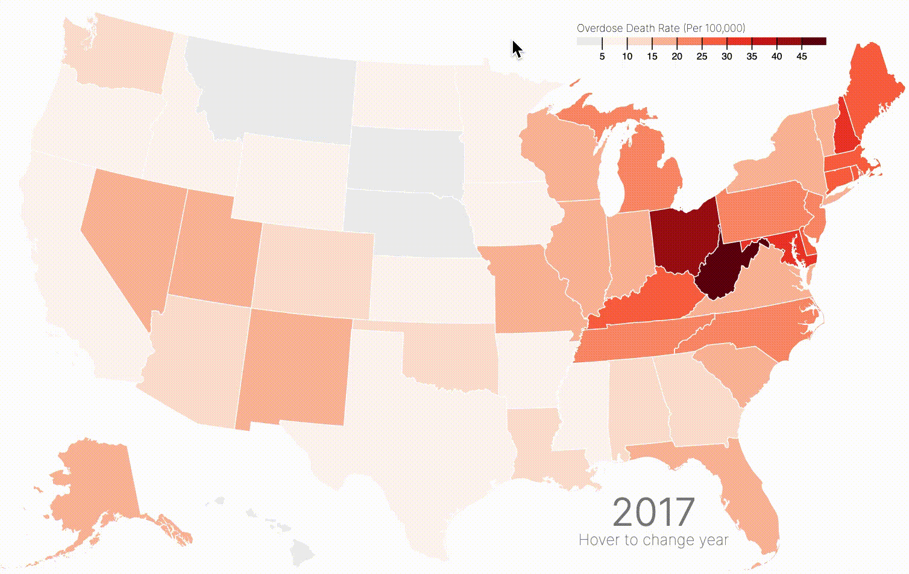

I think tooltips are one of the most underrated parts of a visualization. When users are initially confused by a visualization, they often hover over a data point of interest to get more information.

Unfortunately, many tooltips fail to really illuminate much about our data. They often recapitulate what is already being presented without clarifying any of the confusing parts of the data. Most frequently, I see (and even create 😦) tooltips which present the most basic information (in a map, a tooltip would present the state name and the value of interest), and nothing else! 

Of course, there's nothing *wrong* with these kinds of tooltips. But they are truly doing the bare minimum, and, as a result, they're missing out on the full potential of tooltips. **If users are actively seeking more information by hovering over data, we ought to reward them with the most helpful and interesting information we can.**

That's why I recently updated one of my tooltips from a static presentation of textual information to a line chart depicting change over time. In other words, I went from this:



to this:


    
## Why did I make that change?

The former tooltip provided information which was rather uninteresting. Although it clarified the exact *rate* of overdose deaths in a given state at a given time, it didn't do much else. It did provide the year currently in view, but this was also visible in the bottom right corner of the visualization! It also provided the state name, but most of my viewers have likely taken US geography in middle school.

Thus, this tooltip was rather redundant. At best, it provided the *exact* rate, so that a viewer could compare two states, or learn more information about a given state without solely relying on color encoding ([which can be somewhat unreliable when it comes to quantitative encoding](https://courses.cs.washington.edu/courses/cse442/17au/lectures/CSE442-VisualEncoding.pdf), as is the case in a choropleth map). 

The new tooltip shows a trend over time. It also shows the state name (just in case you skipped that day in US geography!), and also the most recent data on overdose deaths. Because this map is meant to show how the opioid crisis *has evolved*, showing a line chart for each state in my tooltip allows the user to explore state-by-state trends on hover! This is much easier than hovering on each state during each year and trying to keep track of the trends.

For example, hovering on West Virginia, which in 2017 seemed to have the highest opioid-involved overdose death rate (as indicated by it having the darkest shade of red), reveals that its also experienced one of the largest over-time increase in this rate since 1999:


## So, how do you do it?

Great question! It's thankfully not that hard, but the payoff is huge. The shift from my old, boring tooltip to my new, sexy one took only a couple of hours, thanks to a few [Stack Overflow answers](https://stackoverflow.com/questions/43904643/add-chart-to-tooltip-in-d3) and [online examples](https://bl.ocks.org/maelafifi/ee7fecf90bb5060d5f9a7551271f4397).

### Step 1: Load `d3-tip`

The process mostly relies on `d3-tip`, which you can learn more about [here](http://labratrevenge.com/d3-tip/).

You can load `d3-tip`with the following code:

```javascript
<script src="https://cdnjs.cloudflare.com/ajax/libs/d3-tip/0.7.1/d3-tip.min.js"></script>
```

### Step 2: Create a tooltip object

Next, you initialize your tooltip, give it a class (for CSS styling), and provide the specified `offset`. In my example, I define my offset according to the [user's mouse position](https://stackoverflow.com/questions/28536367/in-d3-js-how-to-adjust-tooltip-up-and-down-based-on-the-screen-position). That way, if a user hovers over an eastern state, the tooltip doesn't disappear off the screen!

```javascript
  // define the tooltip 
var tool_tip = d3.tip()
  .attr("class", "d3-tip")
  // if the mouse position is greater than 650 (~ Kentucky/Missouri), offset tooltip to the left instead of the right
  .offset(function() {if(current_position[0] > 650) {
  	return [-20,-120] } 
  	else { return [20,120]}
  })
  // input the title, and include the div
  .html(
  	"<p>Opioid-involved deaths over time in</p><div id='tipDiv'></div>"
  );

svg.call(tool_tip);
```

The most important part here is

```javascript
.html(
     "<p>Opioid-involved deaths over time in</p><div id='tipDiv'></div>"
);
```

where we define the html that creates the tooltip itself. In our case, we provide a title, "Opioid-involved deaths over time", and also specify the div that the tooltip should include. 

### Step 3: Create the `tipDiv` object

Finally, we can create the `tipDiv` object we referenced in the above code. The object will be created on mouseover of the group of interest (in my case, states). Thus, the code will look something like this:

```javascript
states = svg.append("g")
  .attr("class", "states")
  .selectAll("path")
  .data(topojson.feature(us, us.objects.states).features)
  .enter()
  .append("path")
  .attr("d", path)
  .on('mouseover', function(d) {

// define and store the mouse position. this is used to define tooltip offset, seen above.
current_position = d3.mouse(this); 				

// define current state
current_state = nameById[d.id]
	
// show the tooltip
tool_tip.show();
```

After that initialization and `show` function, we can define the `tipDiv` object:

```javascript
var tipSVG = d3.select("#tipDiv")
     .append("svg")
     .attr("width", 220)
     .attr("height", 55);

tipSVG.append("path")
     .datum(overdoses.filter(function(d) {return nameById[d.id] == current_state}))
     .style("stroke", function() {
     	if (rateById[d.id] < 10) {
     		return "grey"
     	} else {
     	return color(rateById[d.id])
     	}
 	  })
     .style("stroke-width", 1.5)
     .style("fill", "none")
     .attr("d", line)
     
tipSVG.append("circle")
     .attr("fill", function() {
     	if (rateById[d.id] < 10) {
     		return "grey"
     	} else {
     	return color(rateById[d.id])
     	}
 	  })
    .attr("stroke", "black")
    .attr("cx", 130)
    .attr("cy", y_tooltip(rateById[d.id]))
    .attr("r", 3)

tipSVG.append("text")
     .text(rateById[d.id] + " deaths")
     .attr("x", 140)
     .attr("y", function() {
     	if (y_tooltip(rateById[d.id]) < 15) { return 10 }
     		else { return y_tooltip(rateById[d.id]) - 7 }
     	})

tipSVG.append("text")
     .text("per 100,000")
     .attr("x", 140)
     .attr("y", function() {
     	if (y_tooltip(rateById[d.id]) < 15) { return 24 }
     		else { return y_tooltip(rateById[d.id]) + 7 }
     	})
	
tipSVG.append("text")
     .text(current_state)
     .attr("x", 0)
     .attr("y", 15)
     .style("font-size", 18)
     .style("font-weight", 400)
 })
.on('mouseout', tool_tip.hide)
```

What's happening here? Let's look at one piece at a time.

**First**, we define the object and name it `tipSVG`. `tipSVG` selects `#tipDiv` (defined in our d3-tip) and appends an SVG. We also define the width and height of the tooltip.

```javascript
var tipSVG = d3.select("#tipDiv")
	      .append("svg")
	      .attr("width", 220)
	      .attr("height", 55);
```

**Next**, we append a path to that SVG. This could be a circle, or a rectangle, or any other appendable shape. Because I am drawing a simple line, we use `path`.

```javascript
tipSVG.append("path")
  .datum(overdoses.filter(function(d) {return nameById[d.id] == current_state}))
  .style("stroke", function() {
  	if (rateById[d.id] < 10) {
  		return "grey"
  	} else {
  	return color(rateById[d.id])
  	}
	  })
  .style("stroke-width", 1.5)
  .style("fill", "none")
  .attr("d", line)
```

In defining the `d` attribute, you see I use the phrase `line`. This is defined earlier in my code to return the x and y position of each data point, to create the path itself.

```javascript
var x_tooltip = d3.scaleLinear()
  .domain(d3.extent(overdoses, function(d) { return d.year; }))
  .range([ 0, 130 ]);

var y_tooltip = d3.scaleLinear()
  .domain([0, 60])
  .range([ 50, 0 ]);

var line = d3.line()
  .x(function(d) {
    return x_tooltip(d.year);
  })
  .y(function(d) {
    return y_tooltip(+d.rate);
  })
```

**Lastly**, we add a circle at the end of the line to signify the final data point. We also add the text label for the year 2017.
	      
```javascript
tipSVG.append("circle")
  .attr("fill", function() {
  	if (rateById[d.id] < 10) {
  		return "grey"
  	} else {
  	return color(rateById[d.id])
  	}
	  })
   .attr("stroke", "black")
  .attr("cx", 130)
  .attr("cy", y_tooltip(rateById[d.id]))
  .attr("r", 3)

tipSVG.append("text")
  .text(rateById[d.id] + " deaths")
  .attr("x", 140)
  .attr("y", function() {
  	if (y_tooltip(rateById[d.id]) < 15) { return 10 }
  		else { return y_tooltip(rateById[d.id]) - 7 }
  	})

tipSVG.append("text")
  .text("per 100,000")
  .attr("x", 140)
  .attr("y", function() {
  	if (y_tooltip(rateById[d.id]) < 15) { return 24 }
  		else { return y_tooltip(rateById[d.id]) + 7 }
  	})

tipSVG.append("text")
  .text(current_state)
  .attr("x", 0)
  .attr("y", 15)
  .style("font-size", 18)
  .style("font-weight", 400)
 })
```

And finally, we hide the tooltip on mouseout:

```javascript
.on('mouseout', tool_tip.hide)
```

Thanks for reading! You can play around with the visualization and checkout the tooltip for yourself here (find the fullscreen version [here](https://connorrothschild.github.io/D3.js/map-overdoses/)):

<div>    
<svg width="960" height="600"></svg>
</div>


<style>

@import url('https://rsms.me/inter/inter.css');
html { font-family: 'Inter', sans-serif; }
@supports (font-variation-settings: normal) {
  html { font-family: 'Inter var', sans-serif; }
}

.states :hover {
  stroke: white;
  stroke-width: 8px;
}

.year.label {
  font: 300 2.5em "Inter";
  fill: gray;
}

.helper.label {
  font: 150 1em "Inter";
  fill: gray;
}

.overlay {
  fill: none;
  pointer-events: all;
  cursor: ew-resize;
}

.caption {
  font: 150 1.1em "Inter";
}

.d3-tip {
  padding-right: 6px;
  padding-left: 6px;
  padding-bottom: 6px;
  padding-top: 0;
  background: #fff;
  border: 1px solid black;
  font-size: 12px;
  pointer-events: none !important;
}

/* .my_chart {
	width: 90%;
	padding-left: 15%;
	padding-right: 10%;
} */

</style>

<script src="https://d3js.org/d3.v4.min.js"></script>
<script src="https://d3js.org/d3-scale-chromatic.v1.min.js"></script>
<script src="https://d3js.org/topojson.v1.min.js"></script>
<script src="https://d3js.org/queue.v1.min.js"></script>
<script src="https://cdnjs.cloudflare.com/ajax/libs/d3-tip/0.7.1/d3-tip.min.js"></script>
<script>

/* This viz was made a lot easier thanks to the following code:

* animation using TweenYear
http://bl.ocks.org/jgujgu/bfbb41f5e8b90ff09d7805f71ef2538e
* choropleth map of us states (using json fips state ids)
https://bl.ocks.org/chucklam/f628765b873d707a3d0e44ffc78deab8
* another choropleth; although I didn't end up following its structure it was a helpful introduction
https://bl.ocks.org/wboykinm/dbbe50d1023f90d4e241712395c27fb3

A special thanks to Robert Hosbach for his viz here (and his willingness to respond to my email!): https://rahosbach.github.io/2018-10-27-d3UnemploymentChoropleth/
*/  

var svg = d3.select("svg")
  .attr("class", "my_chart")
  // resize plot when window is resized (see below)
  .call(responsivefy);

var path = d3.geoPath();
var format = d3.format("");
var height = 600;
var width = 960;

// thanks to https://brendansudol.com/writing/responsive-d3 for this function!
function responsivefy(svg) {
  // container will be the DOM element
  // that the svg is appended to
  // we then measure the container
  // and find its aspect ratio
  const container = d3.select(svg.node().parentNode),
      width = parseInt(svg.style('width'), 10),
      height = parseInt(svg.style('height'), 10),
      aspect = width / height;

  // set viewBox attribute to the initial size
  // control scaling with preserveAspectRatio
  // resize svg on inital page load
  svg.attr('viewBox', `0 0 ${width} ${height}`)
      .attr('preserveAspectRatio', 'xMinYMid')
      .call(resize);

  // add a listener so the chart will be resized
  // when the window resizes
  // multiple listeners for the same event type
  // requires a namespace, i.e., 'click.foo'
  // api docs: https://goo.gl/F3ZCFr
  d3.select(window).on(
      'resize.' + container.attr('id'), 
      resize
  );

  // this is the code that resizes the chart
  // it will be called on load
  // and in response to window resizes
  // gets the width of the container
  // and resizes the svg to fill it
  // while maintaining a consistent aspect ratio
  function resize() {
      const w = parseInt(container.style('width'));
      svg.attr('width', w);
      svg.attr('height', Math.round(w / aspect));
  }
}

// options for color scheme: https://github.com/d3/d3-scale-chromatic
var colorScheme = d3.schemeReds[9];
colorScheme.unshift("#eee");

// building the legend at the top
var color = d3.scaleQuantize()
  .domain([0, 50])
  .range(colorScheme);
var x = d3.scaleLinear()
  .domain(d3.extent(color.domain()))
  // the range specifies the x position of the legend
  .rangeRound([600,860]);
var g = svg.append("g")
  .attr("transform", "translate(0,40)");

// legend boxes
g.selectAll("rect")
  .data(color.range().map(function(d){ return color.invertExtent(d); }))
  .enter()
  .append("rect")
    .attr("height", 8)
    .attr("x", function(d){ return x(d[0]); })
    .attr("width", function(d){ return x(d[1]) - x(d[0]); })
    .attr("fill", function(d){ return color(d[0]); });

// legend title
g.append("text")
  .attr("class", "caption")
  .attr("x", x.range()[0])
  .attr("y", -6)
  .attr("fill", "#000")
  .attr("text-anchor", "start")
  .attr("font-weight", 30)
  .text("Overdose Death Rate (Per 100,000)");

// legend ticks
g.call(d3.axisBottom(x)
  .tickSize(13)
  .tickFormat(format)
  .tickValues(color.range().slice(1).map(function(d){ return color.invertExtent(d)[0]; })))
  .select(".domain")
  .remove();

// create tooltip
var div = d3.select("body")
  .append("div")
  .attr("class", "tooltip")
  .style("opacity", 0);

// label positions
labely = height - 50
labelx = width - 280

// Add the year label; the value is set on transition.
var label = svg.append("text")
  .attr("class", "year label")
  .attr("text-anchor", "middle")
  // position the label
  .attr("y", labely)
  .attr("x", labelx)
  .text(1999);

var helperlabel = svg.append("text")
  .attr("class", "helper label")
  .attr("text-anchor", "middle")
  // position the label
  .attr("y", labely + 20)
  .attr("x", labelx)
  .text("Hover to change year");

queue()
  // read in JSON which includes all of the complicated shape data for states/counties/etc.
  .defer(d3.json, "https://d3js.org/us-10m.v1.json")
  // read in opioid data
  .defer(d3.csv, "figures/overdoses.csv")
  /*
  NOTE ON OVERDOSE DATA: 

  This CSV file was created via pulling data from CDC's WONDER database.

  I pulled all deaths from the National Vital Statistics System's multiple cause-of-death mortality files which had one of the following causes of death: opioids (T40.0, T40.1, T40.2, T40.3, T40.4, or T40.6)**; natural/semisynthetic opioids (T40.2); methadone (T40.3); heroin (T40.1); synthetic opioids other than methadone (T40.4); cocaine (T40.5). I followed the methodology of this paper: https://www.cdc.gov/mmwr/volumes/67/wr/mm675152e1.htm?s_cid=mm675152e1_w. Deaths may include multiple opioids as a cause and thus are not mutually exclusive.

  You can replicate the data pull on CDC WONDER with this link: https://wonder.cdc.gov/mcd-icd10.html

  Source: Multiple Cause of Death 1999–2017 on CDC Wide-ranging Online Data for Epidemiologic Research (CDC WONDER). Atlanta, GA: CDC, National Center for Health Statistics. 2018. Available at http://wonder.cdc.gov. 
  */
  .await(ready);

function ready(error, us, overdoses) {
  if (error) throw error;

    // Initialize data to 1990
    var currentYear = 1999;
    var rateById = {};
    var nameById = {};
    // var yearById = {};
    
    //console.table(overdoses)
    
    overdoses.forEach(function(d){
   	  rateById[d.id] = +d.rate;
      nameById[d.id] = d.state;
      d.year = d.year;
  });

   	console.table(overdoses)

    // Add an overlay for the year label.
    var box = label.node().getBBox();
    
    var overlay = svg.append("rect")
      .attr("class", "overlay")
      .attr("x", box.x)
      .attr("y", box.y)
      .attr("width", box.width)
      .attr("height", box.height)
      .on("mouseover", enableInteraction);

  var x_tooltip = d3.scaleLinear()
    .domain(d3.extent(overdoses, function(d) { return d.year; }))
    .range([ 0, 130 ]);

  var y_tooltip = d3.scaleLinear()
    .domain([0, 60])
    .range([ 50, 0 ]);

  // define line function
  var line = d3.line()
    .x(function(d) {
      return x_tooltip(d.year);
    })
    .y(function(d) {
      return y_tooltip(+d.rate);
    })

  var tool_tip = d3.tip()
  .attr("class", "d3-tip")
  // if the mouse position is greater than 650 (~ Kentucky/Missouri), 
  // offset tooltip to the left instead of the right
  // credit https://stackoverflow.com/questions/28536367/in-d3-js-how-to-adjust-tooltip-up-and-down-based-on-the-screen-position
  .offset(function() {if(current_position[0] > 650) {
  	return [-20,-120] } 
  	else { return [20,120]}
  })
  .html(
  	"<p>Opioid-involved deaths over time in</p><div id='tipDiv'></div>"
  );

	svg.call(tool_tip);
	
	// Start a transition that interpolates the data based on year.
	svg.transition()
	  .duration(10000)
	  .ease(d3.easeLinear)
	  .tween("year", tweenYear);
	
	states = svg.append("g")
	  .attr("class", "states")
	  .selectAll("path")
	  .data(topojson.feature(us, us.objects.states).features)
	  .enter()
	  .append("path")
	  .attr("d", path)
	  // appending svg inside of tooltip for year by year change.
	  // h/t https://bl.ocks.org/maelafifi/ee7fecf90bb5060d5f9a7551271f4397
	  // h/t https://stackoverflow.com/questions/43904643/add-chart-to-tooltip-in-d3
	   .on('mouseover', function(d) {
	
	   	// define and store the mouse position. this is used to define
	   	// tooltip offset, seen above.
		current_position = d3.mouse(this); 				
	   	//console.log(current_position[0])
	
	   	current_state = nameById[d.id]
	
	    tool_tip.show();
	    var tipSVG = d3.select("#tipDiv")
	      .append("svg")
	      .attr("width", 220)
	      .attr("height", 55);
	
	    tipSVG.append("path")
	      .datum(overdoses.filter(function(d) {return nameById[d.id] == current_state}))
	      .style("stroke", function() {
	      	if (rateById[d.id] < 10) {
	      		return "grey"
	      	} else {
	      	return color(rateById[d.id])
	      	}
	  	  })
	      .style("stroke-width", 1.5)
	      .style("fill", "none")
	      .attr("d", line)
	      
	    tipSVG.append("circle")
	      .attr("fill", function() {
	      	if (rateById[d.id] < 10) {
	      		return "grey"
	      	} else {
	      	return color(rateById[d.id])
	      	}
	  	  })
	      .attr("stroke", "black")
	      .attr("cx", 130)
		  .attr("cy", y_tooltip(rateById[d.id]))
		  .attr("r", 3)
	
	    tipSVG.append("text")
	      .text(rateById[d.id] + " deaths")
	      // .transition()
	      // .duration(1000)
	      .attr("x", 140)
	      .attr("y", function() {
	      	if (y_tooltip(rateById[d.id]) < 15) { return 10 }
	      		else { return y_tooltip(rateById[d.id]) - 7 }
	      	})
	
		tipSVG.append("text")
	      .text("per 100,000")
	      // .transition()
	      // .duration(1000)
	      .attr("x", 140)
	      .attr("y", function() {
	      	if (y_tooltip(rateById[d.id]) < 15) { return 24 }
	      		else { return y_tooltip(rateById[d.id]) + 7 }
	      	})
	
	    tipSVG.append("text")
	      .text(current_state)
	      // .transition()
	      // .duration(1000)
	      .attr("x", 0)
	      .attr("y", 15)
	      .style("font-size", 18)
	      .style("font-weight", 400)


	  })
  	  .on('mouseout', tool_tip.hide)
      .call(style, currentYear)

 // FOR BAR CHART //
   //    .on('mouseover', function(d) {
	  //   tool_tip.show();
	  //   var tipSVG = d3.select("#tipDiv")
	  //     .append("svg")
	  //     .attr("width", 200)
	  //     .attr("height", 50);

	  //   tipSVG.append("rect")
	  //     .attr("fill", color(rateById[d.id]))
	  //     .attr("y", 10)
	  //     .attr("width", 0)
	  //     .attr("height", 30)
	  //     .transition()
	  //     .duration(1000)
	  //     .attr("width", rateById[d.id] * 6);
	
	  //   tipSVG.append("text")
	  //     .text(rateById[d.id] + " per 100,000")
	  //     .attr("x", 10)
	  //     .attr("y", 30)
	  //     .transition()
	  //     .duration(1000)
	  //     .attr("x", 6 + rateById[d.id] * 6)
	  // })
  	//   .on('mouseout', tool_tip.hide)
   //    .call(style, currentYear)

    function style(states, year){
      newoverdoses = interpolateData(year);
    
    var rateById = {};
    var nameById = {};
    
    newoverdoses.forEach(function(d) {
    
      // each state is encoded according to its ANSI/FIPS state code
      // you can find states and their codes here https://en.wikipedia.org/wiki/List_of_U.S._state_abbreviations#ANSI_standard_INCITS_38:2009
      rateById[d.id] = +d.rate;
      nameById[d.id] = d.state;
      d.year = d.year;
      
    });
    
    // add fill according to death rates, for each id (state)
    states.style("fill", function(d) { return color(rateById[d.id]); })
    // OLD TOOLTIP // 
      // .on("mouseover", function(d) {      
      //     div.transition()        
      //       .duration(200)      
      //       .style("opacity", .9);  
    
      // // add tooltip here    
      //     div.html('<strong> State: </strong>' + nameById[d.id] + 
      //       '<br>' + 
      //       '<strong> Year: </strong>' + Math.round(currentYear) +
      //       '<br>' + 
      //       '<strong> Rate: </strong>' + rateById[d.id] + " per 100,000")
      //       .style("left", (d3.event.pageX) + "px")     
      //       .style("top", (d3.event.pageY - 28) + "px");})   
      //  // remove tooltip on mouse out               
      //  .on("mouseout", function(d) {       
      //     div.transition()        
      //      .duration(500)      
      //      .style("opacity", 0);});

  // create the actual state objects
  svg.append("path")
    .datum(topojson.mesh(us, us.objects.states, (a, b) => a !== b))
    .attr("fill", "none")
    .attr("stroke", "white")
    // .attr("stroke-linejoin", "round")
    .attr("d", path)
   }

  // after the transition finishes, mouseover to change  year.
  function enableInteraction() {
    var yearScale = d3.scaleLinear()
      .domain([1999, 2017])
      .range([box.x + 10, box.x + box.width - 10])
      .clamp(true);

    // Cancel the current transition, if any.
    svg.transition().duration(0);
    
    overlay
      .on("mouseover", mouseover)
      .on("mouseout", mouseout)
      .on("mousemove", mousemove)
      .on("touchmove", mousemove);
    
    function mouseover() { label.classed("active", true); }
    function mouseout() { label.classed("active", false); }
    function mousemove() { displayYear(yearScale.invert(d3.mouse(this)[0])); }
  }

  // Tweens the entire chart by first tweening the year, and then the data.
  // For the interpolated data, the dots and label are redrawn.
  function tweenYear() {
    var year = d3.interpolateNumber(1999, 2017);
    return function(t) { displayYear(year(t)); };
  }

  // Updates the display to show the specified year.
  function displayYear(year) {
    currentYear = year;
    states.call(style,year)
    label.text(Math.round(year));
  }

  // Interpolates the dataset for the given (fractional) year.
  function interpolateData(year) {
    return overdoses.filter(function(row) {
    return row['year'] == Math.round(year);
     });
    }
};
    </script> 


