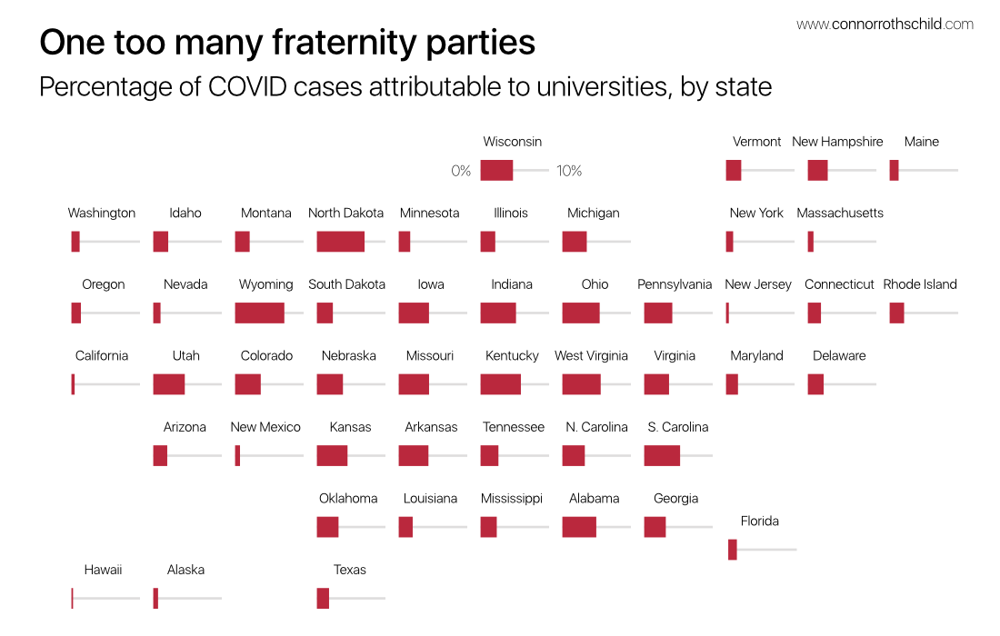

```{r setup, include=FALSE}
knitr::opts_chunk$set(echo = FALSE, message = FALSE, warning = FALSE)
```

```{r}
library(tidyverse)
library(reactable)
library(htmltools)
```

```{r}
append_date_suffix <- function(dates) {
  suff <- case_when(
    dates %in% c(11, 12, 13) ~ "th",
    dates %% 10 == 1 ~ 'st',
    dates %% 10 == 2 ~ 'nd',
    dates %% 10 == 3 ~ 'rd',
    TRUE ~ "th"
  )
  paste0(dates, suff)
}
```

```{css} 
.bar-cell {
  display: flex;
  align-items: center;
}

.number {
  font-family: "Fira Mono", Consolas, Monaco, monospace;
  font-size: 13.5px;
  white-space: pre;
}

.bar-chart {
  flex-grow: 1;
  margin-left: 6px;
  height: 14px;
}

.bar {
  height: 100%;
}

.header {
  border-bottom: 2px solid #555;
  font-size: 13px;
  font-weight: 400;
  text-transform: uppercase;
}

.header:hover {
  background-color: #eee;
}

.my-row:hover {
  background-color: #f5f8ff;
}

.rt-search {
  font-size: 13px;
  font-weight: 300;
  /* text-align: center; */
}

.table-title {
  font-weight: 500;
  font-size: 22px;
  font-family: -apple-system, BlinkMacSystemFont, "Segoe UI", Helvetica, Arial, sans-serif;
  margin-bottom: 0;
}

.table-subtitle {
  font-weight: 300;
  font-size: 16px;
  font-family: -apple-system, BlinkMacSystemFont, "Segoe UI", Helvetica, Arial, sans-serif;
}

.last-updated {
  font-size: 12px;
  font-family: -apple-system, BlinkMacSystemFont, "Segoe UI", Helvetica, Arial, sans-serif;
  text-align: right;
  text-transform: uppercase;
}
```

```{r}
college_raw <-
  readr::read_csv(
    "https://raw.githubusercontent.com/nytimes/covid-19-data/master/colleges/colleges.csv"
  ) %>% filter(!is.na(cases))
cases_raw <-
  readr::read_csv("https://github.com/nytimes/covid-19-data/raw/master/live/us-counties.csv")

college <- college_raw %>%
  mutate(loc = paste0(county, " County, ", state)) %>%
  group_by(loc) %>%
  summarise(
    college_cases = sum(cases),
    colleges_listed = paste(college, collapse = ", ")
  )

cases <- cases_raw %>%
  mutate(loc = paste0(county, " County, ", state)) %>%
  select(loc, cases)

joined <- left_join(cases, college)

processed <- joined %>%
  separate(loc, into = c('county', 'state'), sep = ' County, ', remove = FALSE) %>%
  mutate(pct_college = college_cases / cases) %>%
  arrange(desc(pct_college)) %>%
  filter(!is.na(college_cases),
         college_cases > 0)
```

On July 17, Rice University announced [its plan](https://coronavirus.rice.edu/news/message-president-leebron-july-17) for the fall semester, which included a hybrid mode of instruction where students could attend classes either virtually or in person. The decision wasn't without controversy; in the weeks that followed, [multiple](https://www.ricethresher.org/article/2020/08/return-to-campus-but-to-what-end) [faculty](https://www.ricethresher.org/article/2020/07/letter-to-the-editor-on-returning-to-the-classroom) [members](https://www.ricethresher.org/article/2020/07/letter-to-the-editor-re-evaluate-return-to-campus) at Rice wrote of their concerns with the plan began classes, eventually culminating in a [petition](https://www.ricethresher.org/article/2020/08/faculty-senate-will-meet-to-discuss-risks-and-benefits-of-returning-to-campus) to convene a campus-wide discussion regarding the risks and benefits of opening campus. The petition garnered nearly 100 faculty signatures.

Despite such complaints, Rice opened its doors to in-person students on August 11th. And despite all of the concerns, the university has done a remarkable job at keeping COVID case counts relatively low. 

```{r}
blogdown::shortcode('tweet', '1296495845664272386')
```

Rice's success at maintaining low case counts--[recording](https://coronavirus.rice.edu/) only 37 positive cases across 36,183 tests as of October 10--is not typical of most colleges. At universities across the country, reopening was often accompanied by a [surge](https://apnews.com/article/virus-outbreak-indiana-muncie-b62eacec9bd3fff89eeab1a8de72f819) in new COVID-19 cases; surges that, in many instances, forced those universities to [reverse](https://www.jsonline.com/story/news/education/2020/09/09/uw-madison-pauses-person-classes-two-weeks/5766409002/) their [reopening](https://www.nytimes.com/2020/08/17/us/unc-chapel-hill-covid.html) [decisions](https://www.usnews.com/news/education-news/articles/2020-09-08/facing-coronavirus-spikes-colleges-send-students-home-against-the-warnings-of-public-health-officials) within just a few weeks.

The table below presents cumulative university-affiliated COVID cases, broken down by college (from the [New York Times](https://github.com/nytimes/covid-19-data/tree/master/colleges)):

```{r}
red_pal <- function(x) rgb(colorRamp(c("#FFFFFF", "#BA283D"))(x), maxColorValue = 255)

college_table <- reactable(
  college_raw %>% mutate(loc = paste0(county, ' County, ', state)) %>% arrange(desc(cases)) %>% mutate(rank = row_number()) %>% select(college, loc, cases, rank),
  columns = list(
    college = colDef(name = 'University',
                     sortable = FALSE),
    loc = colDef(name = 'Location',
                 sortable = FALSE),
    cases = colDef(
      width = 100,
      style = function(value) {
        normalized <- (value - min(college_raw$cases)) / (max(college_raw$cases) - min(college_raw$cases))
        midpoint <- nrow(college_raw)
        color <- red_pal(normalized)
        fontColor <- ifelse(value < midpoint, "#000000", "#FFFFFF")
        list(background = color,
             color = fontColor)
      }
    ),
    rank = colDef(
      name = 'Rank',
      width = 60
    )
  ),
  rowClass = "my-row",
  theme = reactableTheme(
    style = list(fontFamily = "-apple-system, BlinkMacSystemFont, Segoe UI, Helvetica, Arial, sans-serif",
                 fontSize = '.85em'), 
    searchInputStyle = list(width = "100%")
  ),
  paginationType = "simple",
  language = reactableLang(
    searchPlaceholder = "Search for a university, county, or state",
    noData = "No data found.",
    pageInfo = "{rowStart} to {rowEnd} of {rows} entries",
    pagePrevious = "\u276e",
    pageNext = "\u276f"
  ),
  searchable = TRUE,
  defaultSorted = 'cases',
  defaultSortOrder = 'desc',
  showSortIcon = FALSE,
  defaultColDef = colDef(headerClass = "header", align = "left")
)
```

```{r}
div(
  div(
    p(class = 'table-title', "COVID-19 on Campus"),
      college_table,
        p(class = 'last-updated',
          paste0(
            "Last updated ",
            format(Sys.Date(), "%B "),
            append_date_suffix(as.numeric(format(Sys.Date(
            ), "%d"))),
            ", ",
            format(Sys.Date(), "%Y")
          )
        )
    )
)
```


In addition to the criticism leveled against university administrators for jeopardizing the health and safety of their *students*, to what extent have reopenings put the community at large at greater risk? 

One way to answer this question is to analyze case counts attributable to university students as a relative proportion of a county's overall case counts. The New York Times offers data in both forms: [college-affiliated cases](https://github.com/nytimes/covid-19-data/tree/master/colleges) and [county cases](https://github.com/nytimes/covid-19-data/blob/master/live/us-counties.csv) (cumulative). In combination, the data tells a story about which colleges are struggling the most with COVID-19, which college towns saw a COVID spike after university reopenings, and which cities have problems much larger than students throwing fraternity parties.

Below, you can explore your county's case count relative to its university-affiliated case counts.

```{r}
county_table <- reactable(
  processed,
  columns = list(
    loc = colDef(show = FALSE),
    colleges_listed = colDef(show = FALSE),
    county = colDef(
      name = 'County',
      sortable = FALSE,
    ),
    state = colDef(
      name = 'State',
      sortable = FALSE,
      # filterable = TRUE
    ),
    cases = colDef(name = 'Cases', 
                   format = colFormat(separators = TRUE), 
                   sortable = TRUE),
    college_cases = colDef(
      name = 'University cases',
      sortable = TRUE,
      format = colFormat(separators = TRUE),
      minWidth = 100
    ),
    pct_college = colDef(
      name = "% attributable to universities",
      minWidth = 200,
      align = 'right',
      defaultSortOrder = "desc",
      cell = JS(
        "function(cellInfo) {
                // Format as percentage
                const pct = (cellInfo.value * 100).toFixed(0) + '%'
                // Pad single-digit numbers
                let value = pct.padStart(5)
                // Show % on first row only
                if (cellInfo.viewIndex > 0) {
                  value = value.replace('%', ' ')
                }
                // Render bar chart
                return (
                  '<div class=\"bar-cell\">' +
                    '<span class=\"number\">' + value + '</span>' +
                    '<div class=\"bar-chart\" style=\"background-color: #e1e1e1\">' +
                      '<div class=\"bar\" style=\"width: ' + pct + '; background-color: #BA283D\"></div>' +
                    '</div>' +
                  '</div>'
                )
              }"
      ),
      html = TRUE
    )
  ),
  details = function(index) {
    colleges <-
      college_raw %>% filter(!is.na(cases), cases > 0) %>% mutate(loc = paste0(county, " County, ", state)) %>% filter(loc == processed$loc[index]) %>% select(college, cases) %>% mutate(pct_of_total = cases / sum(cases))
    tbl <-
      reactable(
        colleges,
        rowClass = "my-row",
        showSortIcon = FALSE,
        defaultColDef = colDef(headerClass = "header", align = "left"),
        defaultSorted = 'pct_of_total',
        defaultSortOrder = 'desc',
        columns = list(
          college = colDef(
            name = 'University',
            sortable = FALSE,
            minWidth = 250,
            cell = function(value, index) {
              url <-
                paste0("https://google.com/search?q=", gsub(' ', '%20', paste0(value," COVID-19 cases")))
              htmltools::tags$a(href = url, target = "_blank", as.character(value))
            }
          ),
          cases = colDef(name = "Cases",
                         sortable = TRUE,
                         format = colFormat(separators = TRUE)),
          pct_of_total = colDef(
            name = "% of Total",
            align = 'right',
            sortable = TRUE,
            cell = JS(
              "function(cellInfo) {
                // Format as percentage
                const pct = (cellInfo.value * 100).toFixed(1) + '%'
                // Pad single-digit numbers
                let value = pct.padStart(5)
                // Show % on first row only
                if (cellInfo.viewIndex > 0) {
                  value = value.replace('%', ' ')
                }
                // Render bar chart
                return (
                  '<div class=\"bar-cell\">' +
                    '<span class=\"number\">' + value + '</span>' +
                    '<div class=\"bar-chart\" style=\"background-color: #e1e1e1\">' +
                      '<div class=\"bar\" style=\"width: ' + pct + '; background-color: #BA283D\"></div>' +
                    '</div>' +
                  '</div>'
                )
              }"
            ),
            html = TRUE
          )
        ),
        width = 600
      )
    htmltools::div(style = list(margin = "12px 45px"), tbl)
  },
  onClick = "expand",
  rowStyle = list(cursor = "pointer"),
  rowClass = "my-row",
  theme = reactableTheme(
    style = list(fontFamily = "-apple-system, BlinkMacSystemFont, Segoe UI, Helvetica, Arial, sans-serif",
                 fontSize = '.85em'), 
    searchInputStyle = list(width = "100%")
  ),
  paginationType = "simple",
  language = reactableLang(
    searchPlaceholder = "Search for a county or state",
    noData = "No data found.",
    pageInfo = "{rowStart} to {rowEnd} of {rows} entries",
    pagePrevious = "\u276e",
    pageNext = "\u276f"
  ),
  searchable = TRUE,
  defaultSorted = 'pct_college',
  showSortIcon = FALSE,
  defaultColDef = colDef(headerClass = "header", align = "left")
)
```

```{r}
div(
  div(
    p(class = 'table-title', "COVID-19 on Campus"),
    p(class = 'table-subtitle', "University cases as a proportion of their overall county"),
      county_table,
        p(class = 'last-updated',
          paste0(
            "Last updated ",
            format(Sys.Date(), "%B "),
            append_date_suffix(as.numeric(format(Sys.Date(
            ), "%d"))),
            ", ",
            format(Sys.Date(), "%Y")
          )
        )
    )
)
```

In two counties, Otsego County (New York) and Pickens County (South Carolina), university-affiliated COVID-19 case counts actually *outpace* officially recorded COVID-19 cases in their respective counties. This might signal an issue with the data, or a unique way of treating university students in county-wide case counts. According to one of the investigative reporters who recorded this data at the New York Times, county-wide case totals might not include out-of-state residents, such as college students:

```{r}
blogdown::shortcode('tweet', '1314597852782489602')
```

In other counties, we see a more intuitive picture, where college cases constitute a proportion of overall county cases. Even if the same issue is present in these counties, you can understand generally where university COVID case counts are high relative to their county-wide totals, and where they are not.

###  University-affiliated COVID cases across states

```{r}
library(geofacet)

college_states <- college_raw %>%
  group_by(state) %>%
  summarise(college_cases = sum(cases, na.rm = T))

cases_states <- cases_raw %>%
  group_by(state) %>%
  summarise(cases = sum(cases, na.rm = T))

joined_states <- left_join(cases_states, college_states)

processed_states <- joined_states %>%
  filter(!is.na(college_cases)) %>% 
  mutate(pct_college = college_cases / cases) %>%
  arrange(desc(pct_college))
```

The data also tells a story about COVID case counts on a state-by-state basis, and where college-affiliated cases make up a disproportionate share of cases in the state overall. 

Geographically, the data looks like this (note the x-axis runs from 0 to 10%):

```{r eval = FALSE}
## devtools::install_github("connorrothschild/cr")
cr::set_cr_theme(font = 'Segoe UI')

ggplot(processed_states, aes("", pct_college)) +
  geom_col(width = 1, fill = "#BA283D") +
  coord_flip() +
  facet_geo( ~ state, grid = "us_state_grid1") +
  scale_y_continuous(expand = c(0, 0), limits = c(0, .1)) +
  labs(
    title = "One too many fraternity parties",
    subtitle = "Percentage of COVID cases attributable to universities, by state",
    x = element_blank(),
    y = "Percentage of state's COVID cases (0 to 10%)"
  ) +
  theme(
    axis.text.x = element_blank(),
    axis.line.x = element_blank(), 
    axis.line.y = element_blank(), 
    axis.ticks.x = element_blank(),
    axis.ticks.y = element_blank(),
    strip.text.x = element_text(size = 6),
    strip.background = element_blank()
  )
# ggsave("./figures/geofacet_raw.svg", width = 6, height = 4)
```

<!--  -->

```{r}
blogdown::shortcode("figure", 
          src = "./figures/geofacet_processed.png", 
          alt = "A small multiples map showing proportions of COVID cases attributable to university students",
          lightbox = 'true')
```


In the table below, you can search for your state and drill down on which counties within your state make up the greatest share of COVID-19 cases.

```{r}
state_table <- reactable(
  processed_states,
  columns = list(
    loc = colDef(show = FALSE),
    colleges_listed = colDef(show = FALSE),
    state = colDef(
      name = 'State',
      sortable = FALSE,
      # filterable = TRUE
    ),
    cases = colDef(name = 'Cases', 
                   format = colFormat(separators = TRUE), 
                   minWidth = 100,
                   sortable = TRUE),
    college_cases = colDef(
      name = 'University cases',
      sortable = TRUE,
      format = colFormat(separators = TRUE),
      minWidth = 125
    ),
    pct_college = colDef(
      name = "% attributable to universities",
      minWidth = 200,
      align = 'right',
      defaultSortOrder = "desc",
      cell = JS(
        "function(cellInfo) {
                // Format as percentage
                const pct = (cellInfo.value * 100).toFixed(0) + '%'
                // Pad single-digit numbers
                let value = pct.padStart(5)
                // Show % on first row only
                if (cellInfo.viewIndex > 0) {
                  value = value.replace('%', ' ')
                }
                // Render bar chart
                return (
                  '<div class=\"bar-cell\">' +
                    '<span class=\"number\">' + value + '</span>' +
                    '<div class=\"bar-chart\" style=\"background-color: #e1e1e1\">' +
                      '<div class=\"bar\" style=\"width: ' + pct + '; background-color: #BA283D\"></div>' +
                    '</div>' +
                  '</div>'
                )
              }"
      ),
      html = TRUE
    )
  ),
  details = function(index) {
    colleges <-
      college_raw %>% filter(!is.na(cases), cases > 0) %>% filter(state == processed_states$state[index]) %>% select(college, county, cases) %>% mutate(pct_of_total = cases / sum(cases))
    tbl <-
      reactable(
        colleges,
        rowClass = "my-row",
        showSortIcon = FALSE,
        defaultColDef = colDef(headerClass = "header", align = "left"),
        defaultSorted = 'pct_of_total',
        defaultSortOrder = 'desc',
        columns = list(
          college = colDef(
            name = 'University',
            sortable = FALSE,
            minWidth = 250,
            cell = function(value, index) {
              url <-
                paste0("https://google.com/search?q=", 
                       gsub(' ', '%20', paste0(value, " COVID-19 cases")))
              htmltools::tags$a(href = url, target = "_blank", as.character(value))
            }
          ),
          county = colDef(
            name = 'County',
            sortable = FALSE
          ),
          cases = colDef(name = "Cases",
                         sortable = TRUE,
                         format = colFormat(separators = TRUE)),
          pct_of_total = colDef(
            name = "% of Total",
            align = 'right',
            sortable = TRUE,
            cell = JS(
              "function(cellInfo) {
                // Format as percentage
                const pct = (cellInfo.value * 100).toFixed(1) + '%'
                // Pad single-digit numbers
                let value = pct.padStart(5)
                // Show % on first row only
                if (cellInfo.viewIndex > 0) {
                  value = value.replace('%', ' ')
                }
                // Render bar chart
                return (
                  '<div class=\"bar-cell\">' +
                    '<span class=\"number\">' + value + '</span>' +
                    '<div class=\"bar-chart\" style=\"background-color: #e1e1e1\">' +
                      '<div class=\"bar\" style=\"width: ' + pct + '; background-color: #BA283D\"></div>' +
                    '</div>' +
                  '</div>'
                )
              }"
            ),
            html = TRUE
          )
        ),
        width = 600
      )
    htmltools::div(style = list(margin = "12px 45px"), tbl)
  },
  onClick = "expand",
  rowStyle = list(cursor = "pointer"),
  rowClass = "my-row",
  theme = reactableTheme(
    style = list(fontFamily = "-apple-system, BlinkMacSystemFont, Segoe UI, Helvetica, Arial, sans-serif",
                 fontSize = '.85em'), 
    searchInputStyle = list(width = "100%")
  ),
  paginationType = "simple",
  language = reactableLang(
    searchPlaceholder = "Search for a state",
    noData = "No data found.",
    pageInfo = "{rowStart} to {rowEnd} of {rows} entries",
    pagePrevious = "\u276e",
    pageNext = "\u276f"
  ),
  searchable = TRUE,
  defaultSorted = 'pct_college',
  showSortIcon = FALSE,
  defaultColDef = colDef(headerClass = "header", align = "left"),
)
```

```{r}
div(
  div(
    p(class = 'table-title', "COVID-19 on Campus"),
    p(class = 'table-subtitle', "University cases as a proportion of their overall state"),
      state_table,
        p(class = 'last-updated',
          paste0(
            "Last updated ",
            format(Sys.Date(), "%B "),
            append_date_suffix(as.numeric(format(Sys.Date(
            ), "%d"))),
            ", ",
            format(Sys.Date(), "%Y")
          )
        )
    )
)
```

---

Thanks for reading. You can find the code that creates the tables and graphics for this post [on GitHub](https://github.com/connorrothschild/connorrothschild.com/tree/master/content/post/covid-on-campus/index.Rmd). As always, feel free to message me on [Twitter](https://twitter.com/CL_Rothschild) with any questions, comments, or just to say hi 🙂